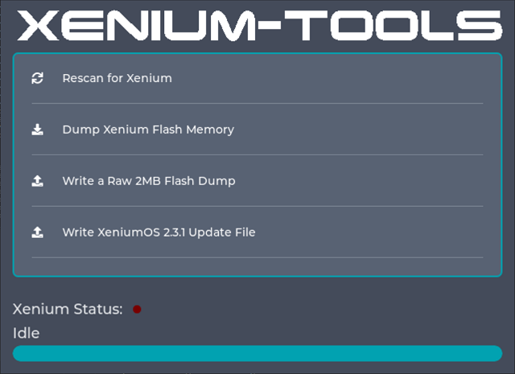

# Installation

## Program CPLD (If building it yourself)
1. To program the CPLD see the [Firmware](./Firmware/README.md). page. Some programming notes are provided below:  
1.1 You will need a good quality JTAG programmer with the ability to parse`.svf` files. Some universal JTAG programming software is `OpenOCD` or `URJtag`. Check these for compatible programmers.  
1.2 The JTAG connection points are located along the edge of the OpenXenium PCB and are clearly labelled on the silkscreen.  
1.3 OpenXenium may require an external 3.3V power supply when programming. The RGB LED should be on when programming.  
1.4 The RGB LED will default to white if the CPLD is unprogrammed and will default to red once programmed.  

## Programming XeniumOS to OpenXenium (If building it yourself)
1. Confirm that the CPLD is programmed as per the above section.
2. Boot your Xbox using another bootable modchip and transfer `default.xbe` from [Xenium-Tools repo](https://github.com/Ryzee119/Xenium-Tools/releases) to your xbox. You must boot the Xbox using another modchip. Booting from the onboard TSOP will prevent xenium-tools from working.
3. Transfer over a xenium 2MB raw `flash.bin` **or** XeniumOS 2.3.1 `recovery.bin` (v2.3.1 only) to the xenium-tools directory.  `flash.bin` is full Xenium flash memory dump obtained from a Genuine Xenium device using xenium-tools (Menu option START+X). This is the recommended file to use as it contains the recovery sector which allows the recovery feature to work on an OpenXenium. 
4. Open the Xenium-Tools xbe. The main menu looks like this   

5. At the main menu, carefully remove the current modchip and replace it with an OpenXenium. Hotswapping is not ideal and so great care should be taken to not drop anything into the Xbox and triple checking pin header alignment before commiting to pushing it onto the header.
6. Select `Rescan for Xenium` to confirm it can detect your OpenXenium. If this doesn't work, confirm you have programmed the CPLD with the OpenXenium firmware (RGB LED should default to red) and you have installed it correctly on the header.
7. Selected  `Write a Raw 2MB Flash Dump` or `Write XeniumOS 2.3.1 Update` accordingly.
8. Confirm no errors are shown.

## OpenXenium Installation in Xbox
1. The following steps assume you have an assembled OpenXenium and have programmed the CPLD and programmed XeniumOS as per the above sections.
2. Install a 7x2 or a 6x2 pin header in the LPC port of your Xbox console.OpenXenium has two extra header pins that purely bring the SDA and SCL pins up to the PCB for easier installation of a [spi2par2019](https://github.com/Ryzee119/spi2par2019) or access to the SMBus data lines. These are completely optional, just be mindful of the pin alignment when you install the OpenXenium onto the header though.  

4. For a **1.6 Xbox** you will need to rebuild the LPC. This can be achieved by manually rewiring using 30AWG solid core wire, or using a LPC rebuild PCB. See below for wiring:   
5. For a **non v1.6** Xbox connect the Xbox motherboard D0 point to the OpenXenium's D0 pad. If you decide to connect the motherboard D0 to ground directly the *Boot From TSOP* feature in XeniumOS will not work.
6. For a **1.6 Xbox** bridge the OpenXenium D0 pad to the nearby 1.6 solder pad on the OpenXenium PCB as per the silk screen markings. See the image below for the location of where the wire bridge should go: It is marked '1.6' on the OpenXenium PCB.  

Example installation on a non-1.6 motherboard with the motherboard's D0 line soldered to the OpenXenium's D0 pad.

